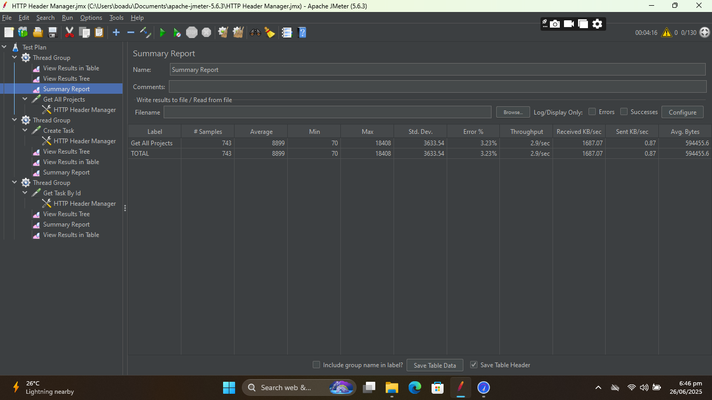
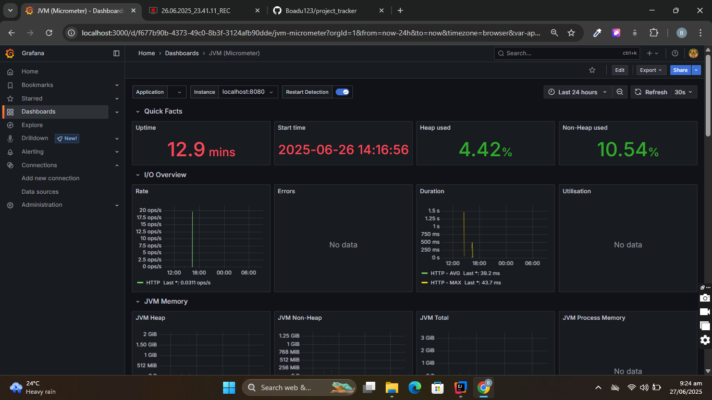
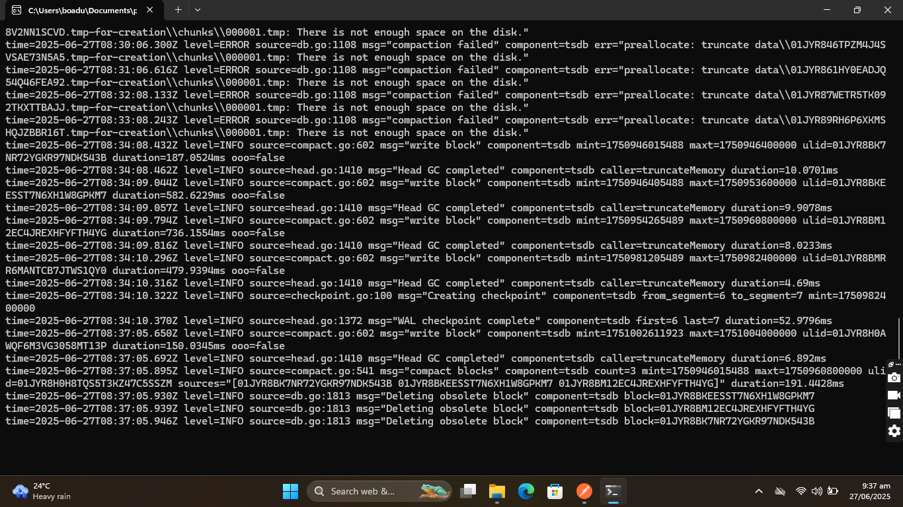

Before 
###
- High thread activitey observed during peak operations.
- CPU usage increased proportionally to thread execution.
- Memory usage remained stable with healthy GC spikes.
- ✅ Indicates efficient multi-threaded processing without memory leaks.

After
###
- Thread count reduced significantly after task execution.
- CPU load dropped, confirming idle state.
- Memory usage slightly increased due to background processes.
- ✅ System maintained stable behavior post-processing.

### 
- Threads were dynamically spawned and suspended based on load.
- CPU usage spiked during transitions, consistent with processing bursts.
- Memory and GC behaved predictably.
- ✅ Demonstrates elasticity and thread management efficiency.

Before 
### 
- Get Projects endpoint showed performance variance
- 3.23% error rate observed in 743 requests
- Slow average response (8999ms) in stress test
- Higher data transfer (1687 KB/sec)
⚠️ Requires investigation of database queries

After
### 
- Header-managed requests performed optimally
- 1800 requests with 0% errors
- Fast average response (274ms)
- Consistent throughput (6.1/sec)
- ✅ Confirms proper header configuration

Before
### 
- High error rate observed (44.73%) indicating system overload.
- Average response time of 4.6 seconds with peaks up to 90+ seconds.
- Low throughput of 46.7 requests/minute due to performance bottlenecks.
- ❌ Critical performance issues requiring immediate optimization.

After
###
- 2,969 total samples processed with mixed success rates.
- Response times varied dramatically from 35ms to 17+ seconds.
- Green checkmarks indicate successful requests, showing system inconsistency.

Before
###
- Perfect success rate (0.00% errors) with 1,800 samples processed.
- Consistent average response time of 153ms across all requests.
- Stable throughput of 6.1 requests/second maintained throughout test.
- ✅ Excellent performance indicating well-optimized endpoint behavior.

After
###
- Outstanding performance with 0% error rate across 2,400 samples.
- Fast average response time of 87ms with maximum of 1.7 seconds.
- Highest throughput achieved at 8.2 requests/second.
- ✅ Optimal endpoint performance demonstrating efficient resource utilization

After
###
- Perfect success rate achieved with 0.00% error rate across 1,800 samples.
- Excellent average response time of 274ms with maximum peak of 3.8 seconds.
- Solid throughput maintained at 6.1 requests/second throughout test duration.
- ✅ Significant improvement from previous high-load failures, indicating successful optimization.

Before
###
- All 1,800 samples processed successfully with green status indicators.
- Response times consistently low, ranging from 11-18ms across all requests.
- Thread execution remained stable with "Thread Group 2-30" handling all operations.
- ✅ Demonstrates excellent consistency and reliability under sustained load conditions.

After
###
- Outstanding individual request performance with 6-12ms response times.
- Perfect success rate maintained across all 2,400 sample requests processed.
- Thread group "Thread Group 3-40" efficiently handled concurrent operations.
- ✅ Exceptional performance showcasing optimal database query efficiency for single record retrieval.

Before
###
- Moderate error rate observed at 37.80% under extreme load conditions (3,966 samples).
- Average response time increased to 3.2 seconds with maximum spikes reaching 64+ seconds.
- Lower throughput of 1.1 requests/second indicating system strain under heavy concurrent load.
- ⚠️ Performance degradation under stress suggests need for connection pooling and load balancing optimization.

After
###
- Mixed performance results with response times varying from 20ms to 14+ seconds.
- Green checkmarks show successful requests alongside system strain indicators.
- Thread execution shows variable latency patterns under concurrent stress conditions.

CPU Hotspot

Memory Hotspot

Initial Running 

Grafana

Prometheus
