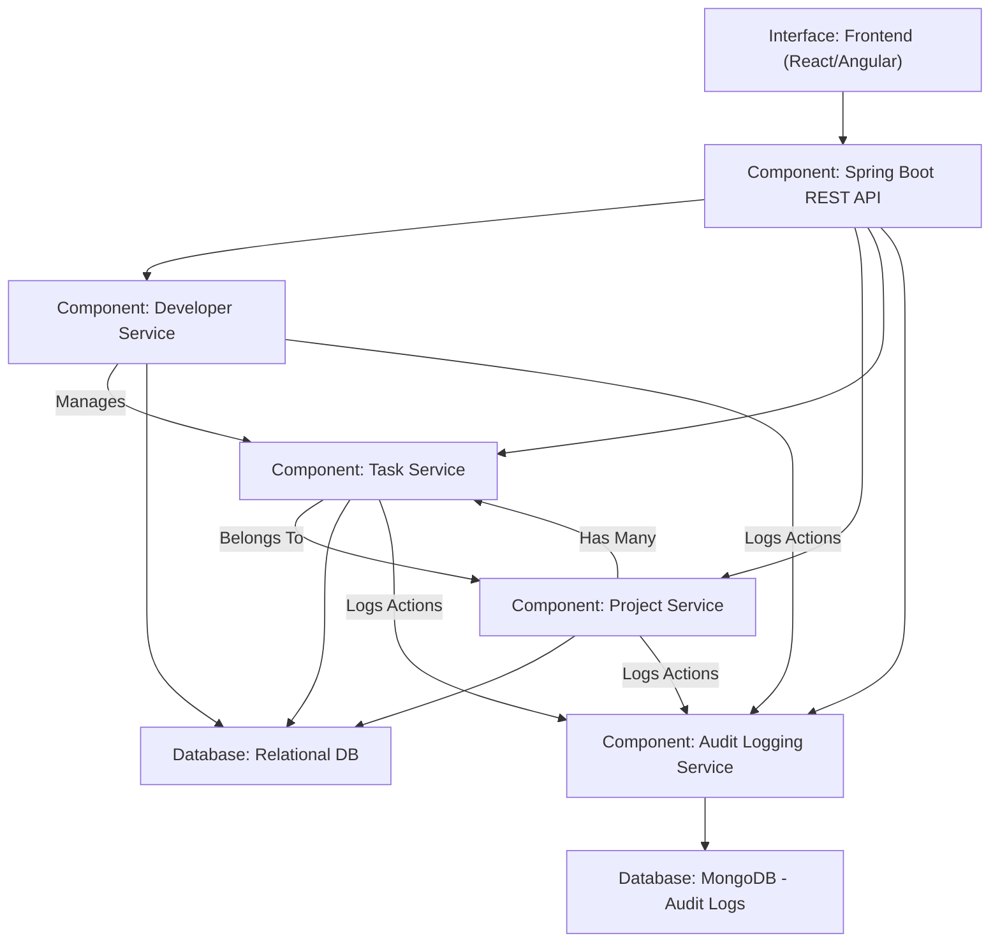

# Task Manager API 🚀


A robust **Spring Boot** REST API for Project Tracker with full CRUD operations, built with modern best practices.

## Features ✨

- **Complete Project Tracker**:
    - Create, read, update, and delete Developers, Task and Project
    - Sort Task by status, creation time and due date
    - Paginated retrieving all Developers

- **Modern Architecture**:
    - Clean layered design (Controller → Service → Repository)
    - Proper DTO separation
    - Comprehensive validation
    - Global exception handling

- **Production Ready**:
    - Docker containerization
    - Full API documentation (PostMan)
    - Proper HTTP status codes

## Tech Stack 💻

| Component           | Technology      |
|---------------------|-----------------|
| Framework           | Spring Boot 3.x |
| Language            | Java 17 LTS     |
| Build Tool          | Maven           |
| Containerization    | Docker          |
| API Documentation   | PostMan         |


## Getting Started 🏁

### Prerequisites

- Java 17 LTS
- Maven 3.8+
- Docker (optional)

### Installation

1. Clone the repository:
   ```bash
   git clone https://github.com/Boadu123/project_tracker
   cd project_tracker
   ```

2. Build the project:
   ```bash
   mvn clean package
   ```

3. Start-app Locally
   ./mvnw spring-boot:run

### Docker Setup
```bash
# Build the image
docker-compose up --bild .


## API Documentation 📚

Interactive API documentation is available at:
```
https://documenter.getpostman.com/view/29757568/2sB2x2La9W
```

## API Endpoints 🌐

Method	Endpoint	Description
Developer
POST	/api/developers	Create a new developer
GET	/api/developers	Get all developers
GET	/api/developers/{id}	Get a specific developer by ID
DELETE	/api/developers/{id}	Delete a developer
PUT	/api/developers/{id}	Update a developer

Project
POST	/api/projects	Create a new project
GET	/api/projects	Get all projects
GET	/api/projects/{id}	Get a specific project by ID
DELETE	/api/projects/{id}	Delete a project
PUT	/api/projects/{id}	Update a project

Task
GET	/api/tasks	Get all tasks
POST	/api/tasks	Create a new task
GET	/api/tasks/{id}	Get a specific task by ID
PUT	/api/tasks/{id}	Update a task
DELETE	/api/tasks/{id}	Delete a task

AuditLogs
GET	/api/logs	Get all audit logs
GET	/api/logs/entity/{entityType}	Get audit logs filtered by entity type
GET	/api/logs/actor/{actionName}	Get audit logs filtered by action name

```

## Project Structure 🗂️

```
project_tracker/
├── src/
│   ├── main/
│   │   ├── java/
│   │   │   └── com/example/project_tracker/
│   │   │       ├── controllers/       # REST controllers
│   │   │       ├── DTO/               # Data Transfer Objects
│   │   │       ├── enums/             # Enum types
│   │   │       ├── exceptions/        # Custom exceptions
│   │   │       ├── mapper/            # Mapping logic (e.g., DTO <-> Entity)
│   │   │       ├── models/            # Domain models
│   │   │       ├── repository/        # Data access layer
│   │   │       ├── service/           # Business logic (missing in screenshot, but typically here)
│   │   │       ├── utils/             # Utility/helper classes
│   │   │       └── ProjectTrackerApplication.java  # Main Spring Boot class
│   │   └── resources/
│   │       ├── static/                # Static assets
│   │       ├── templates/             # Thymeleaf or other view templates
│   │       └── application.properties # Application config
│   └── test/                          # Unit and integration tests
├── target/                            # Compiled output
├── .gitignore
├── .gitattributes
├── docker-compose.yml
├── Dockerfile
├── mvnw / mvnw.cmd                   # Maven wrapper
├── pom.xml                           # Maven project file
└── README.md                         # Project documentation
```

## ERD Diagram 


## Component Diagram 📊


## Best Practices ✅

- **Inversion of Control** through Spring DI
- **Layered architecture** for separation of concerns
- **Immutable DTOs** for API contracts
- **Proper HTTP semantics** (status codes, methods)
- **Comprehensive validation** on all inputs
- **Containerization** for consistent deployments