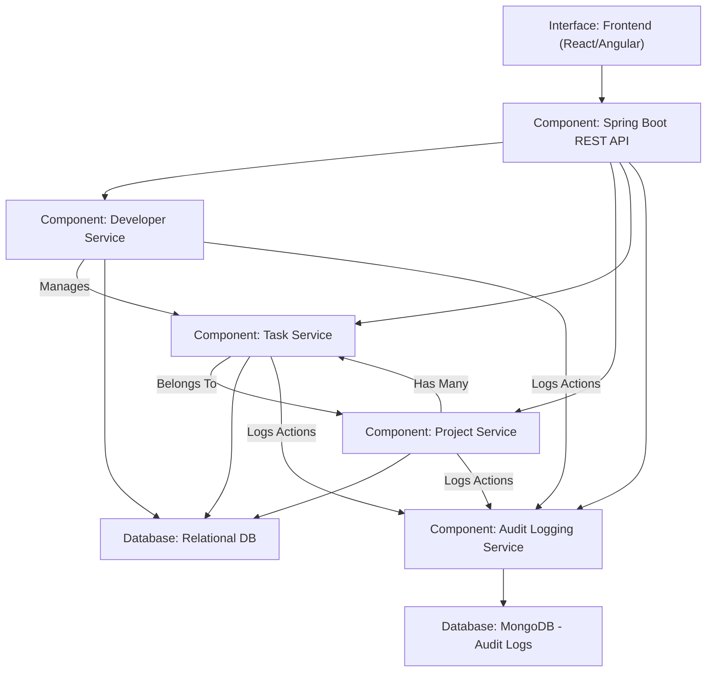

# Task Manager API 🚀


A robust **Spring Boot** REST API for Project Tracker with full CRUD operations, built with modern best practices.

## Features ✨

- **Complete Project Tracker**:
    - Create, read, update, and delete Users, Task and Project
    - Sort Task by status, creation time and due date
    - Paginated retrieving all Developers
    - Authentication is implemented using JWT to securely verify users before accessing protected endpoints
    - Role-based authorization restricts access based on user roles. 

- **Modern Architecture**:
    - Clean layered design (Controller → Service → Repository)
    - Proper DTO separation
    - Comprehensive validation
    - Global exception handling

- **Production Ready**:
    - Docker containerization
    - Full API documentation (PostMan)
    - Proper HTTP status codes

## Tech Stack 💻

| Component           | Technology      |
|---------------------|-----------------|
| Framework           | Spring Boot 3.x |
| Language            | Java 17 LTS     |
| Build Tool          | Maven           |
| Containerization    | Docker          |
| API Documentation   | PostMan         |


## Getting Started 🏁

### Prerequisites

- Java 17 LTS
- Maven 3.8+
- Docker (optional)

### Installation

1. Clone the repository:
   ```bash
   git clone https://github.com/Boadu123/project_tracker
   cd project_tracker
   ```

2. Build the project:
   ```bash
   mvn clean package
   ```

3. Start-app Locally
   ./mvnw spring-boot:run

### Docker Setup
```bash
# Build the image
docker-compose up --bild .


## API Documentation 📚

Interactive API documentation is available at:
```
http://localhost:8080/swagger-ui/index.html

Only Admins has access to the console


The Endpoints below can be accessed without being authenticated
"/auth/register",
```
{
    "name": "george",
    "email": "george@gmail.com",
    "password": "george7896",
    "skills": ["Python", "Spring Boot"],
    "roles": "ROLE_CONTRACTOR"
}
```

"/auth/login",

```
{
    "email": "george@gmail.com",
    "password": "george7896"
}
```
"/oauth2/**", 

"/login.html"

## Project Structure 🗂️

```
project_tracker/
src/
└── main/
    └── java/
        └── com.example.project_tracker/
            ├── annotations/
            │   └── Auditable.java
            ├── aspects/
            │   └── AuditAspect.java
            ├── controllers/
            │   ├── AuditLogController.java
            │   ├── AuthController.java
            │   ├── OAuthController.java
            │   ├── ProjectController.java
            │   ├── TaskController.java
            │   └── UserController.java
            ├── DTO/
            │   ├── request/
            │   │   ├── LoginRequestDTO.java
            │   │   ├── ProjectRequestDTO.java
            │   │   ├── TaskRequestDTO.java
            │   │   └── UserRequestDTO.java
            │   └── response/
            │       ├── LoginResponseDTO.java
            │       ├── ProjectResponseDTO.java
            │       ├── TaskResponseDTO.java
            │       └── UserResponseDTO.java
            ├── enums/
            │   ├── ProjectStatus.java
            │   ├── Roles.java
            │   └── TaskStatus.java
            ├── exception/
            │   ├── EmailReadyExistsException.java
            │   ├── GlobalExceptionHandler.java
            │   ├── ProjectNotFoundException.java
            │   ├── ResourceNotFoundException.java
            │   ├── TaskNotFoundException.java
            │   └── UserNotFoundException.java
            ├── mapper/
            │   ├── ProjectMapper.java
            │   ├── TaskMapper.java
            │   └── UserMapper.java
            ├── models/
            │   ├── AuditLog.java
            │   ├── Project.java
            │   ├── Task.java
            │   └── User.java
            ├── repository/
            │   ├── AuditLogRepository.java
            │   ├── ProjectRepository.java
            │   ├── TaskRepository.java
            │   └── UserRepository.java
            ├── security/
            │   └── handlers/
            │       ├── CustomAccessDeniedHandler.java
            │       ├── CustomAuthenticationEntryPoint.java
            │       ├── CustomOAuth2SuccessHandler.java
            │       ├── CustomOAuth2UserService.java
            │       ├── CustomUserDetails.java
            │       ├── CustomUserDetailsService.java
            │       ├── JwtAuthFilter.java
            │       ├── JwtUtils.java
            │       ├── SecurityConfig.java
            │       └── TaskSecurity.java
            ├── service/
            │   ├── interfaces/
            │   │   ├── AuditLogServletInterface.java
            │   │   ├── DeveloperServletInterface.java
            │   │   ├── ProjectServletInterface.java
            │   │   ├── TaskServletInterface.java
            │   │   ├── UserServletImplInterface.java
            │   │   └── UserServletInterface.java
            │   └── impl/
            │       ├── AuditLogService.java
            │       ├── AuthService.java
            │       ├── ProjectService.java
            │       ├── TaskService.java
            │       └── UserService.java
            └── utils/
                ├── ErrorResponse.java
                └── SuccessResponseUtil.java│   │   │      
                └── ProjectTrackerApplication.java  # Main Spring Boot class
    │   │   └── resources/
    │   │       ├── static/                # Static assets
    │   │       ├── templates/             # Thymeleaf or other view templates
    │   │       └── application.properties # Application config
    │   └── test/                          # Unit and integration tests
    ├── target/                            # Compiled output
    ├── .gitignore
    ├── .gitattributes
    ├── docker-compose.yml
    ├── Dockerfile
    ├── mvnw / mvnw.cmd                   # Maven wrapper
    ├── pom.xml                           # Maven project file
    └── README.md                         # Project documentation
```

## ERD Diagram 


## Component Diagram 📊


## Best Practices ✅

- **Inversion of Control** through Spring DI
- **Layered architecture** for separation of concerns
- **Immutable DTOs** for API contracts
- **Proper HTTP semantics** (status codes, methods)
- **Comprehensive validation** on all inputs
- **Containerization** for consistent deployments